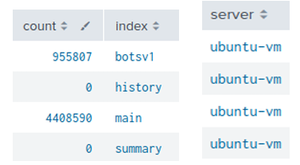
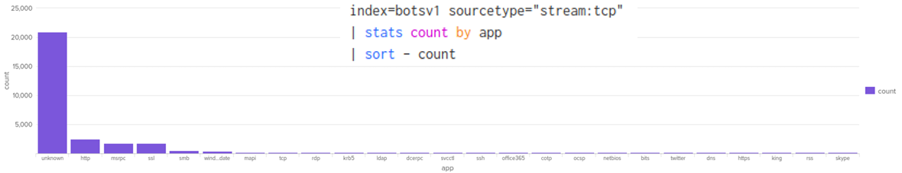
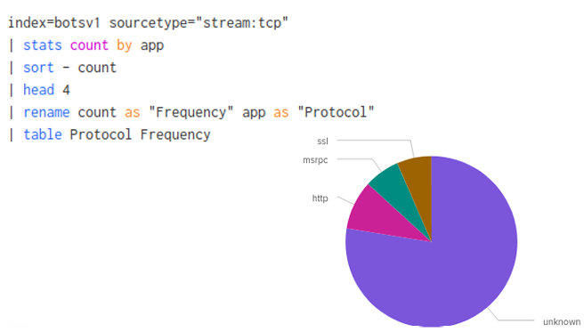
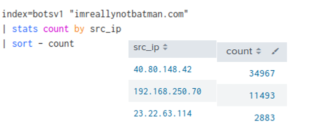
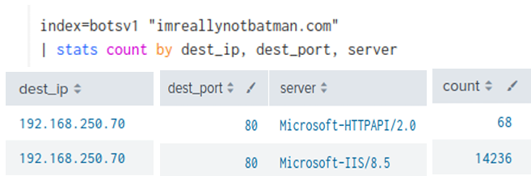
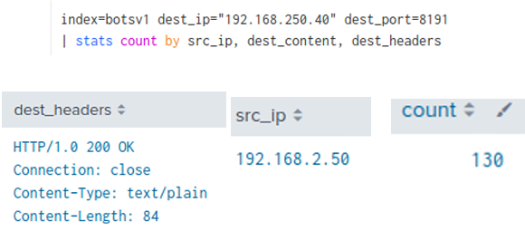
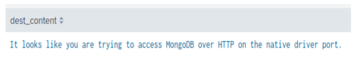
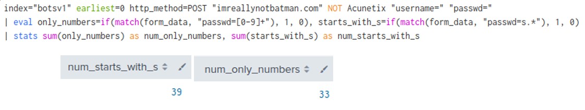

# Splunk Threat Hunting 2024

This repository documents a full threat hunting investigation using Splunk to detect suspicious network activity, scanning attempts, and abnormal traffic patterns.  
The work was originally part of an advanced cybersecurity exam but has since been reviewed, cleaned up, and expanded into a standalone project to showcase applied security analysis skills.

---

## Table of Contents

- [Project Overview](#project-overview)
- [Objectives](#objectives)
- [Tools and Techniques](#tools-and-techniques)
- [Investigation Steps](#investigation-steps)
- [Key Findings](#key-findings)
- [Reflections](#reflections)

---

## Project Overview

This project demonstrates how Splunk can be used to perform practical threat hunting.  
It includes real search queries, results, and visualizations from a live dataset.  
The focus is on identifying active servers, analyzing TCP traffic, detecting scanning IPs, correlating Suricata alerts, and reviewing unusual behavior.

## Objectives

- Practice writing and optimizing Splunk SPL queries
- Identify available indexes and active servers
- Count protocols running over TCP and detect anomalies
- Investigate suspicious IP addresses and triggered alerts
- Document findings clearly with screenshots and explanations

## Tools and Techniques

- **Splunk Enterprise** for search and visualization
- **SPL (Search Processing Language)** for querying data
- **Suricata** for alert correlation
- **Bar and pie charts** to visualize frequency data

## Investigation Steps

### List All Visible Indexes
Command used:

Result showing active indexes and server:

### TCP Protocol Count
Command and bar chart showing protocol usage frequency:

### Top 4 TCP Protocols (Pie Chart)
Command and pie chart showing the four most used protocols:

### Identify Top Source IPs
Command result showing IPs with the highest number of events:

### Server Identification
Command result showing destination IP, port, and web server type:

### Suricata Alert – XSS Detection
Command result showing Cross Site Scripting alert triggered by source IP:

### MongoDB Access Attempt
Detected HTTP access attempt to MongoDB service:

HTTP warning message returned by the service:

### Password Pattern Statistics
Query and result counting number-only passwords and those starting with "s":

---

## Key Findings

- **Indexes:** Only `botsv1` and `main` contained data, confirming where to focus the investigation.
- **Protocols:** Most traffic was marked as unknown, but SSL, MSRPC, and HTTP were also heavily used.
- **Scanning IPs:** 40.80.148.42 generated the most events and triggered multiple Suricata alerts.
- **Server Info:** Destination server was running Microsoft IIS on port 80.
- **MongoDB Probe:** Attempted connections to port 8191 indicated scanning activity against MongoDB.
- **Passwords:** 33 passwords were numeric only, and 39 started with "s", indicating weak credential patterns.

## Reflections

This project was an excellent exercise in practical threat hunting using Splunk.  
Working under exam conditions provided a realistic scenario for time-limited investigations.  
By revisiting and expanding the original work, I was able to improve query optimization, add clear visualizations, and create professional documentation that could be reused for training or portfolio demonstration.

---

*Created by **Mahamed Maki Saine** – Cybersecurity Enthusiast | Threat Hunter | AI Learner*
