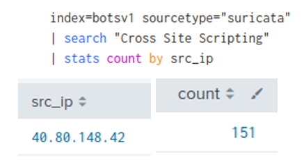

# Splunk Threat Hunting 2024

This repository documents a complete threat hunting investigation using Splunk to identify malicious network activity, scanning attempts, and unusual patterns.  

The original analysis was performed under exam conditions as part of an advanced cybersecurity assessment, but it has since been reviewed, expanded, and documented in greater detail to highlight practical threat hunting skills.  

---

## Table of Contents

- [Project Overview](#project-overview)
- [Objectives](#objectives)
- [Tools and Techniques](#tools-and-techniques)
- [Investigation Steps](#investigation-steps)
- [Key Findings](#key-findings)
- [Lessons Learned](#lessons-learned)
- [Reflections](#reflections)

---

## Project Overview

Threat hunting is the proactive process of searching through networks, systems, and datasets to detect and isolate malicious activity before it causes harm.  

In this project, Splunk SPL (Search Processing Language) was used to explore network telemetry, identify high-risk IP addresses, and correlate alerts with Suricata IDS data.  

The goal was not just to complete the tasks but to simulate the process of a security analyst working in a Security Operations Center (SOC), triaging alerts and finding root causes.

---

## Objectives

- Gain hands-on experience with Splunk SPL by writing targeted searches  

- Enumerate available indexes and identify which contain relevant data  

- Profile network traffic and understand protocol distribution  

- Detect potential scanning activity and malicious IP addresses  

- Correlate IDS alerts with observed network events  

- Produce clear documentation that could be used for reporting or training  

---

## Tools and Techniques

- **Splunk Enterprise:** Core platform for log collection, search, and visualization  

- **SPL (Search Processing Language):** Used to filter, count, and transform data  

- **Suricata IDS:** Source of intrusion alerts, used to cross-reference suspicious events  

- **Data Visualization:** Bar and pie charts for protocol frequency analysis  

- **Evidence-based Documentation:** Screenshots and explanations for reproducibility  

---

## Investigation Steps

### Enumerating Indexes

The first step was to identify all available indexes and determine where relevant data resided.  

Command used:  

Result showing that only `botsv1` and `main` contained data:  

---

### Protocol Frequency Analysis

To understand the environment, all TCP protocol activity was counted and sorted.  

Most traffic was labeled as `unknown`, but other important protocols like HTTP, MSRPC, and SSL were also observed.  

---

### Top 4 Protocols

A second query was used to select and visualize the four most common protocols. This provides better focus on the most relevant traffic.  

---

### Identifying Scanning IPs

Source IP addresses were analyzed to find potential scanners. The highest number of events originated from `40.80.148.42`.  

---

### Server Fingerprinting

The investigation confirmed that the target server was running Microsoft IIS on port 80, which could be relevant for attack surface mapping.  

---

### Correlating Suricata Alerts

Using Suricata alerts, it was confirmed that `40.80.148.42` triggered a Cross-Site Scripting warning.  

---

### MongoDB Access Attempt

The logs also revealed an attempt to access a MongoDB service on port 8191.  

HTTP warning message returned by the service:  

---

### Password Pattern Statistics

Finally, password data was analyzed to look for weak patterns.  

---

## Key Findings

- **Indexes:** Only `botsv1` and `main` contained data, confirming where to focus the investigation.  

- **Protocols:** Most traffic was marked as unknown, but SSL, MSRPC, and HTTP were also heavily used.  

- **Scanning IPs:** 40.80.148.42 generated the most events and triggered multiple Suricata alerts.  

- **Server Info:** Destination server was running Microsoft IIS on port 80.  

- **MongoDB Probe:** Attempted connections to port 8191 indicated scanning activity against MongoDB.  

- **Passwords:** 33 passwords were numeric only, and 39 started with "s", indicating weak credential patterns.  

---

## Lessons Learned

This investigation highlighted the importance of combining log analysis with intrusion detection data.  

It also reinforced that threat hunting is iterative, each finding can lead to new queries and deeper insights.  

Understanding normal traffic patterns is key to identifying anomalies quickly and accurately.  

---

## Reflections

This project was an excellent exercise in practical threat hunting using Splunk.  

Working under exam conditions provided a realistic scenario for time-limited investigations.  

By revisiting and expanding the original work, I was able to improve query optimization, add clear visualizations, and create professional documentation that could be reused for training or portfolio demonstration.  

---

*Created by **Mahamed Maki Saine** – Cybersecurity Enthusiast | Threat Hunter | AI Learner*  

